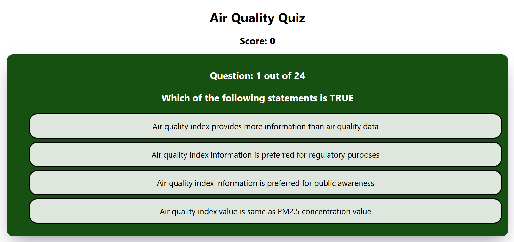

# Multiple Choice Quiz (ReactJS)

Answer the quiz on: [AirQualityQuiz](https://urbanemissionsinfo.github.io/airqualityquiz/)

## Deploy on GH pages
[Video tutorial](https://www.youtube.com/watch?v=7wzuievFjrk)

## Improvements

### Easy 🟢 
- [ ]**Visual updates**: Animations, Sounds, Font Styling, Background, Colors, etc.
- [x] Store list of questions in a seperate file - `questions.csv`
- [x] Place `questions.csv` on Google Sheets and serve it from there // add 'Loading quiz' for lag.
- [x] Add multiple quiz urls served by multiple GoogleSheets
- [x] Create a #users tracker

### Medium 🟡

- [x] After game reset, **scramble order of questions** randomly
- [x] After clicking an option, show correct answer, then move onto next one (button or pause for 5 seconds)
- [ ] At the end show list of wrong questions with the correct answers
- [ ] Create different ReactJS components

### Hard 🔴 - requires backend.
- [x] Collect scores - total and questionwise.
- [ ] Create a **live leaderboard** of users 
